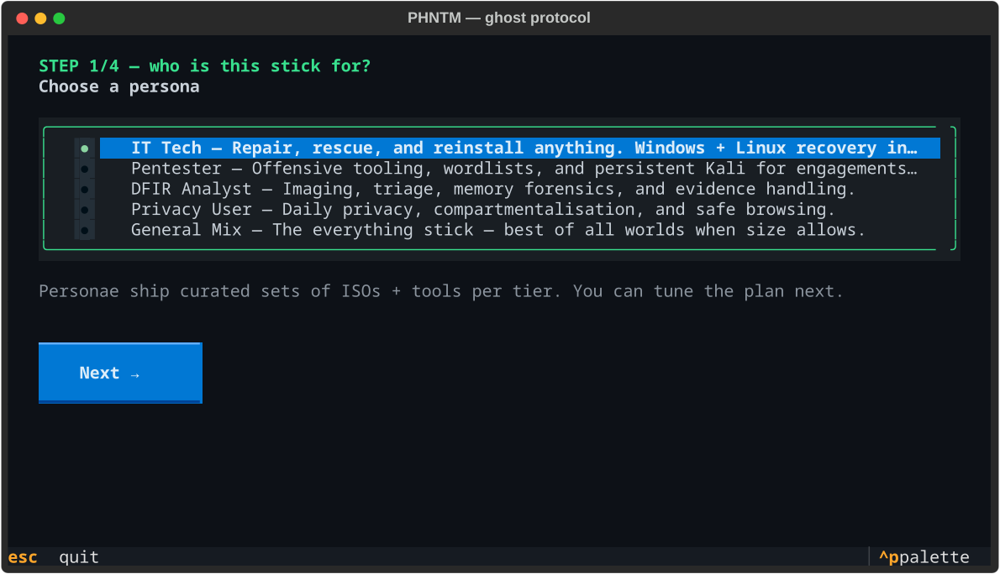
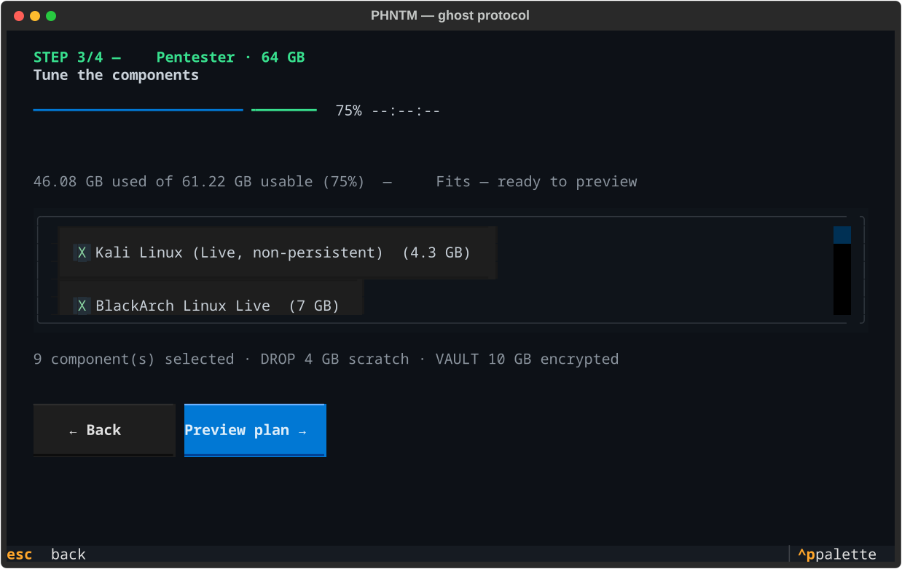
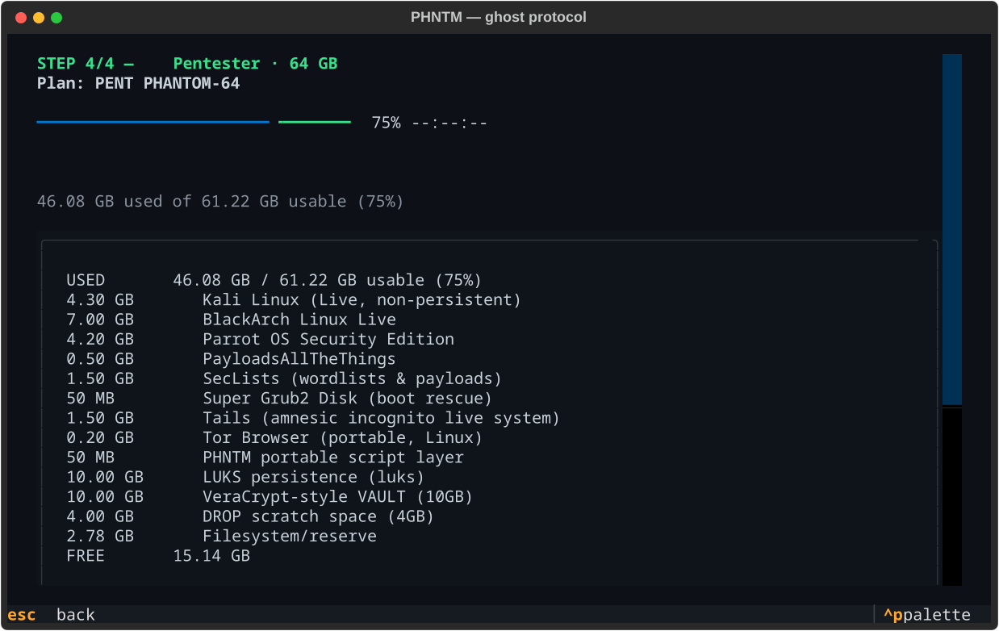

# 👻 PHNTM

<p align="center">
  
</p>

<p align="center">
  &nbsp;
  &nbsp;
  &nbsp;
  &nbsp;
  
</p>

**Build legendary USB sticks.** IT Tech, Pentester, DFIR, Privacy — pick a persona, pick a size, get a battle-tested bootable stick.

**Local-first. Open source (MIT). Zero telemetry. No host. No cloud.**

```
   persona × tier                    ┌─ 16 GB  GHOST    (lean, essentials)
   IT / PENTEST / DFIR / PRIVACY ────┤─ 32 GB  SPECTRE  (standard, workhorse)
   + GENERAL mix                     └─ 64 GB  PHANTOM  (full arsenal)
                                       (+128 GB BANSHEE for GENERAL)
```

## Concept

concept art of the PHNTM idea — originals in `brand/*-ai.png`:

<p align="center">
  
</p>

<p align="center">
  
</p>

---

## The wizard ✨

`phntm tui` — a guided, keyboard-first wizard that turns a persona + a stick size
into a validated build plan you can **tune**, with a **live size meter** that refuses
plans which physically won't fit:

| Pick a persona | Tune the components | Preview the plan |
|:---:|:---:|:---:|
|  |  |  |

```
persona → tier → tune → save   uncheck an ISO/tool or toggle LUKS persistence and
                               the meter reacts live. Every screen is the same
                               engine the CLI uses, so a saved manifest ==
                               `phntm manifest new`
```

## Why PHNTM

- **Manifests, not magic** — every stick is a validated `BuildManifest` (v1). The same file drives building, status, and updates.
- **The size engine** — PHNTM computes the real budget (ISOs + persistence + vault + drop) against the stick's usable capacity and *refuses lies*.
- **sha256 everywhere** — nothing lands on a stick unverified.
- **No-sudo flashing** — Ventoy native **or** Docker fallback. Works on this very workstation.
- **Sees your stick** — `phntm devices` reads size, USB 2.0/3.0/3.1/3.2 speed, vendor/model straight from sysfs; `build -d auto` picks the single plugged stick and refuses sticks that physically can't hold the plan.
- **Your stick, your rules** — encrypted VAULT (cryptsetup/LUKS), LUKS persistence for Kali, DROP scratch folder. Nothing auto-runs. No phoning home.

## Install

```bash
# from the repo (recommended for now)
git clone https://github.com/merouanebenboucherit-cmd/phntm.git
cd phntm
python3 -m venv .venv && .venv/bin/pip install -e ".[dev,tui]"
alias phntm="$HOME/phntm/.venv/bin/phntm"   # or add .venv/bin to PATH

# once published to PyPI:
pip install "phntm[tui]"
```

## Quickstart

```bash
phntm tui                                            # ✨ the wizard: persona → tier → plan
phntm devices                                        # detect stick: size + USB 2.0/3.0 + model
phntm presets                                        # browse personas × tiers
phntm doctor                                         # is this machine build-ready?

phntm build build.json --dry-run                     # full plan, zero side effects
phntm build build.json -d auto -y                    # real build, auto-picks the single stick
phntm status /media/USB                              # what's on the stick
phntm check build.json                               # fresh vs catalog? (stick or manifest)
phntm update                                         # catalog status
```

## Commands

| Command | What it does |
|---|---|
| `phntm tui` | **guided wizard** — persona → tier → tune components → live-meter plan |
| `phntm devices` | detect plugged-in sticks: size, USB speed, vendor/model |
| `phntm presets` | persona × tier matrix — 16 presets with estimated sizes |
| `phntm components [kw]` | browse the catalog (`--persona`, `--category`) |
| `phntm manifest new -p <persona> -t <tier> -o f.json` | create a build manifest |
| `phntm manifest validate -f f.json` | sanity + fits-on-stick check |
| `phntm build f.json --dry-run` | full plan, zero side effects |
| `phntm build f.json -d auto -y` | real build (refuses wrong-size/wrong-category sticks) |
| `phntm status /media/USB` | what a PHNTM stick contains |
| `phntm check <manifest-or-stick>` | freshness diff vs catalog |
| `phntm update` | catalog status |
| `phntm doctor` | is this machine ready to build sticks? |

## Anatomy of a built stick

```
VENTOY          bootloader  (any FAT/EXFAT/NTFS/x86 ISO boots)
 ISOS/          live ISOs + Windows installation media (Ventoy boots them)
 TOOLS/         portable tools incl. PHNTM script layer (router creds, disk info…)
 DROP/          plaintext scratch space you control
 VAULT/         encrypted volume (cryptsetup) — your secrets, your key
 PERSIST/       LUKS persistence volumes for per-OS state (e.g. Kali)
 phntm.json     machine-readable metadata: version, build date, component pins
```

## Status

`1.2.0`

- **Core ✅** manifest engine, catalog (26 components), 16 presets, budget engine, device detection, CLI
- **Wizard ✅** Textual TUI — persona → tier → tune components + live size meter (57 tests)

follow for more

## Project files

- [CHANGELOG.md](CHANGELOG.md) — release history
- [CONTRIBUTING.md](CONTRIBUTING.md) — add catalog entries, run tests, PR flow
- [SECURITY.md](SECURITY.md) — how to report vulnerabilities privately
- [LICENSE](LICENSE) — MIT

## License

MIT. Fork it, build on it — keep the crediting line.