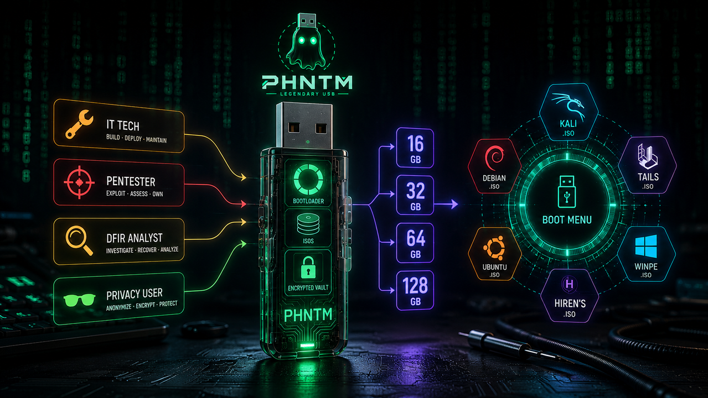
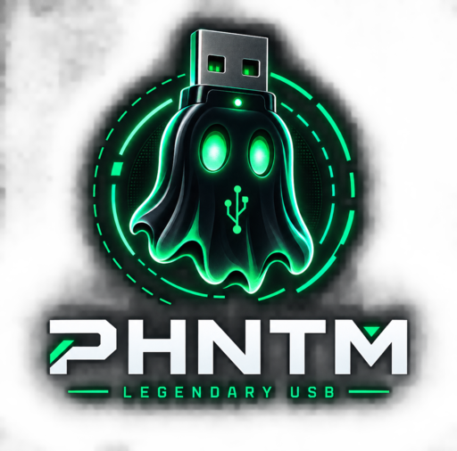

# 👻 PHNTM

<p align="center">
  
</p>


**Build legendary USB sticks.** IT Tech, Pentester, DFIR, Privacy — pick a persona, pick a size, get a battle-tested bootable stick.

**Local-first. Open source (MIT). Zero telemetry. No host. No cloud.**

```
   persona × tier                    ┌─ 16 GB  GHOST    (lean, essentials)
   IT / PENTEST / DFIR / PRIVACY ────┤─ 32 GB  SPECTRE  (standard, workhorse)
   + GENERAL mix                     └─ 64 GB  PHANTOM  (full arsenal)
                                       (+128 GB BANSHEE for GENERAL)
```

## Concept art

AI-generated concept art of the PHNTM idea (prompts in [`brand/IDEA_BRIEF.md`](brand/IDEA_BRIEF.md),
originals in `brand/*-ai.png`):

<p align="center">
  
</p>

<p align="center">
  
</p>

---

## Why PHNTM

- **Manifests, not magic** — every stick is a validated `BuildManifest` (v1). The same file drives building, status, and updates.
- **The size engine** — PHNTM computes the real budget (ISOs + persistence + vault + drop) against the stick's usable capacity and *refuses* lies.
- **sha256 everywhere** — nothing lands on a stick unverified.
- **No-sudo flashing** — Ventoy native **or** Docker fallback. Works on this very workstation.
- **Sees your stick** — `phntm devices` reads size, USB 2.0/3.0/3.1/3.2 speed, vendor/model straight from sysfs; `build -d auto` picks the single plugged stick and refuses sticks that physically can't hold the plan.
- **Your stick, your rules** — encrypted VAULT (cryptsetup/LUKS), LUKS persistence for Kali, DROP scratch folder. Nothing auto-runs. No phoning home.

## Install

```bash
# from the repo (recommended for now)
git clone https://github.com/merouanebenboucherit-cmd/phntm.git
cd phntm
python3 -m venv .venv && .venv/bin/pip install -e ".[dev]"
alias phntm="$HOME/phntm/.venv/bin/phntm"   # or add .venv/bin to PATH

# once published to PyPI:
pip install phntm
```

## Quickstart

```bash
phntm help                                       # pocket guide
phntm devices                                    # detect stick: size + USB 2.0/3.0 + model
phntm presets                                    # browse personas × tiers
phntm components --persona dfir                  # browse catalog
phntm doctor                                     # is this machine build-ready?

phntm manifest new -p pentest -t 32 -o build.json
phntm manifest validate -f build.json            # sanity + fits-on-stick check
phntm build build.json --dry-run                 # full plan, zero side effects
phntm build build.json -d auto -y                # real build, auto-picks the single stick
phntm status /media/USB                          # what's on the stick
phntm check build.json                           # fresh vs catalog? (stick or manifest)
phntm update                                     # catalog status (M4: auto-refresh)
```

## Anatomy of a built stick

```
VENTOY          bootloader  (any FAT/EXFAT/NTFS/x86 ISO boots)
 ISOS/          live ISOs + Windows installation media (Ventoy boots them)
 TOOLS/         portable tools incl. PHNTM script layer (router creds, disk info…)
 DROP/          plaintext scratch space you control
 VAULT/         encrypted volume (cryptsetup) — your secrets, your key
 PERSIST/       LUKS persistence volumes for per-OS state (e.g. Kali)
 phntm.json     machine-readable metadata: version, build date, component pins
```

## Status

`1.0.0` — M1 core: manifest engine, catalog, 16 presets, budget engine, device detection, CLI, 50 tests.
M2 = Textual TUI, M3 = hardware drivers (Ventoy/persist/vault/QEMU), M4 = updates + offline bundles.

## Project files

- [CHANGELOG.md](CHANGELOG.md) — release history
- [CONTRIBUTING.md](CONTRIBUTING.md) — add catalog entries, run tests, PR flow
- [SECURITY.md](SECURITY.md) — how to report vulnerabilities privately
- [LICENSE](LICENSE) — MIT

## License

MIT. Sell it, fork it, build on it — keep the crediting line.